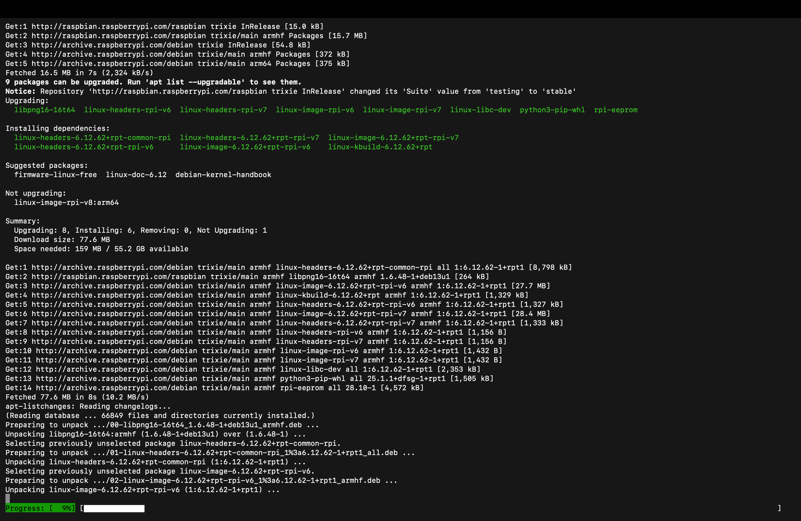
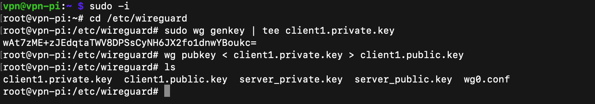
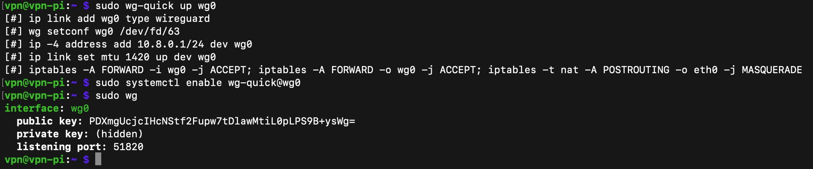
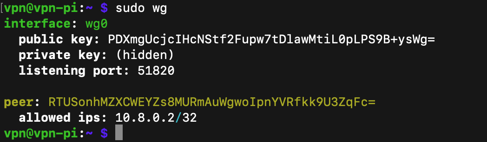
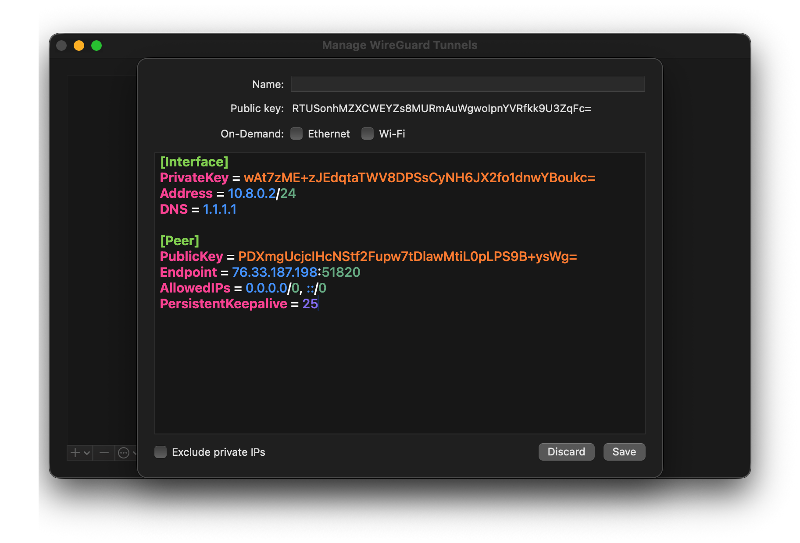

Documentation and screenshots of my self-hosted WireGuard VPN configured on a Raspberry Pi.
# Raspberry Pi WireGuard VPN

This repository documents the setup of my self-hosted WireGuard VPN running on a Raspberry Pi, specifically the Raspberry Pi 4.
The goal of this project was to build a very lightweight, secure VPN server that would allow me to connect to my home's network 
to tunnel traffic through the Raspberry Pi and access the internet or internal
resources securely.

This project focuses on understanding how WireGuard works at the networking level,
including key generation, routing, NAT, and tunnel establishment.

---

## Environment

- Raspberry Pi running Raspberry Pi OS Lite
- WireGuard for the VPN 
- iptables (for NAT and forwarding)
- Client (my MacBook) tested using the WireGuard desktop application

---

## Network Design

- VPN subnet: `10.8.0.0/24`
- VPN server (Raspberry Pi): `10.8.0.1`
- VPN client (MacBook): `10.8.0.2`
- WireGuard UDP port: `51820`

The Raspberry Pi acts as both:
- A WireGuard VPN endpoint
- A router performing Network Address Translation (NAT)

---

## Step-by-Step Setup

### 1. System update and upgrade

I updated the Raspberry Pi to ensure all packages and kernel components were current before
installing WireGuard.

This helped to avoid compatibility issues with kernel modules and networking tools.

---

### 2. Installing WireGuard

WireGuard and its supporting tools were installed using the package manager.
WireGuard is a modern VPN that operates at layer 3 (IP level) and uses
cryptography with a very small attack surface.

---

### 3. Installing iptables

iptables was installed to allow the Raspberry Pi to perform packet forwarding and NAT. 
This was required so my MacBook, or any VPN client, can route traffic through the Pi and out to the internet.

Without iptables masquerading, client traffic would not be able to leave the VPN interface.

---

### 4. Generating server keys

A private and public key pair was generated for the WireGuard server.
The private key stays on the Raspberry Pi and is never shared.
The public key is distributed to clients so they can authenticate the server.

WireGuard uses public-key cryptography for authentication instead of usernames and passwords.

---

### 5. Generating client keys

A separate key pair was generated for my MacBook.
Each client must have its own unique key pair.

This allows the server to identify and control each peer individually.

---

### 6. Enabling IP forwarding

IP forwarding was enabled so the Raspberry Pi can forward packets between interfaces.
This effectively allows the Pi to act as a router.

Without this setting, traffic from the VPN interface would be dropped.

---

### 7. WireGuard interface configuration

The `wg0` interface was configured with:
- VPN IP address
- Listening port
- Server private key
- Firewall and NAT rules using iptables

The interface was then brought up using `wg-quick` and enabled to start on boot.

---

### 8. Assigning client IPs and peers

The client’s public key was added to the server configuration and assigned a static IP
address within the VPN subnet.

This ensures predictable routing and simplifies management.

---

### 9. Client tunnel configuration

The client configuration includes:
- Client private key
- Assigned VPN IP
- Server public key
- Server public endpoint (IP and port)
- Allowed IP ranges

The client is configured to route all traffic through the VPN tunnel.

---

### 10. Tunnel established successfully

Once the tunnel is activated, the client successfully establishes a secure connection
to the Raspberry Pi.

At this point:
- Encrypted traffic flows through the tunnel
- NAT allows outbound internet access
- The VPN is fully operational

---

## Learning Outcomes

Through this project, I gained hands-on experience with:
- VPN architecture and tunneling
- Public-key authentication
- Linux networking and routing
- iptables NAT and forwarding rules
- Secure remote access design
- 
