# Raspberry Pi WireGuard VPN

This repository documents the setup of my self-hosted WireGuard VPN running on a Raspberry Pi 4.
The goal of this project was to build a lightweight, secure VPN server that allows me to
tunnel traffic through the Raspberry Pi and access the internet securely from any of my devices.

This project focuses on understanding how WireGuard works at the networking level,
including key generation, routing, NAT, and tunnel establishment — and has since expanded
to include DNS-level ad blocking with Pi-hole and multi-client support.

---

## Environment

* Raspberry Pi 4 running Raspberry Pi OS Lite
* WireGuard for the VPN
* Pi-hole for DNS-level ad blocking
* iptables (for NAT and forwarding)
* Clients: iPhone (WireGuard iOS app) and MacBook (WireGuard desktop app)

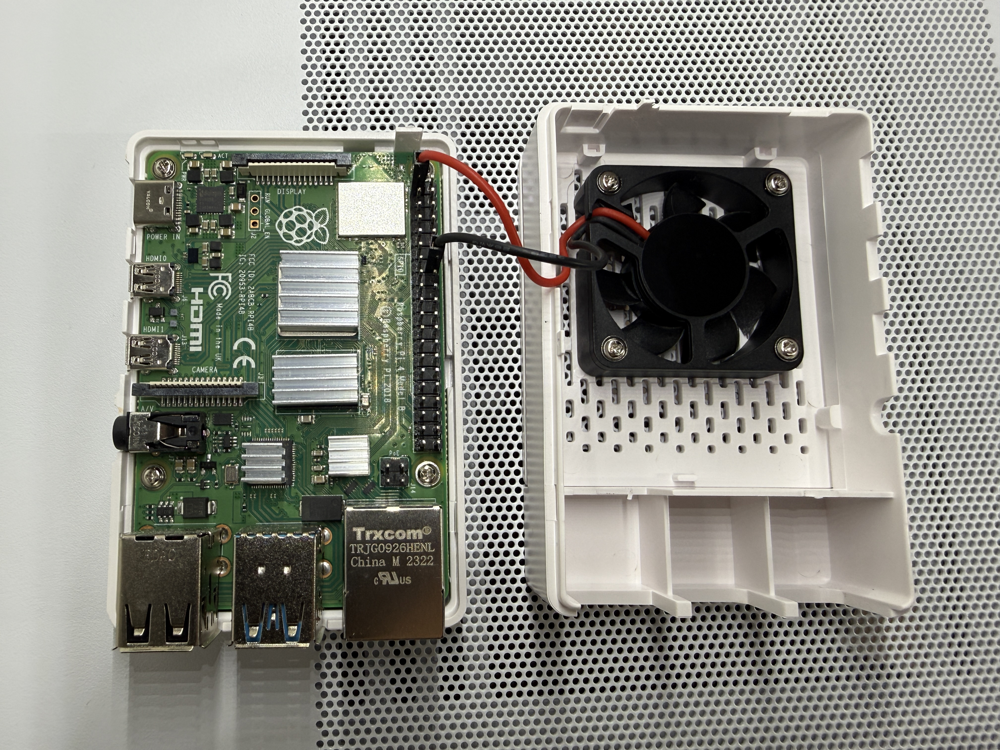
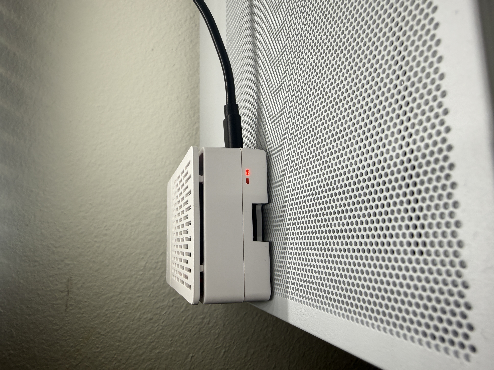
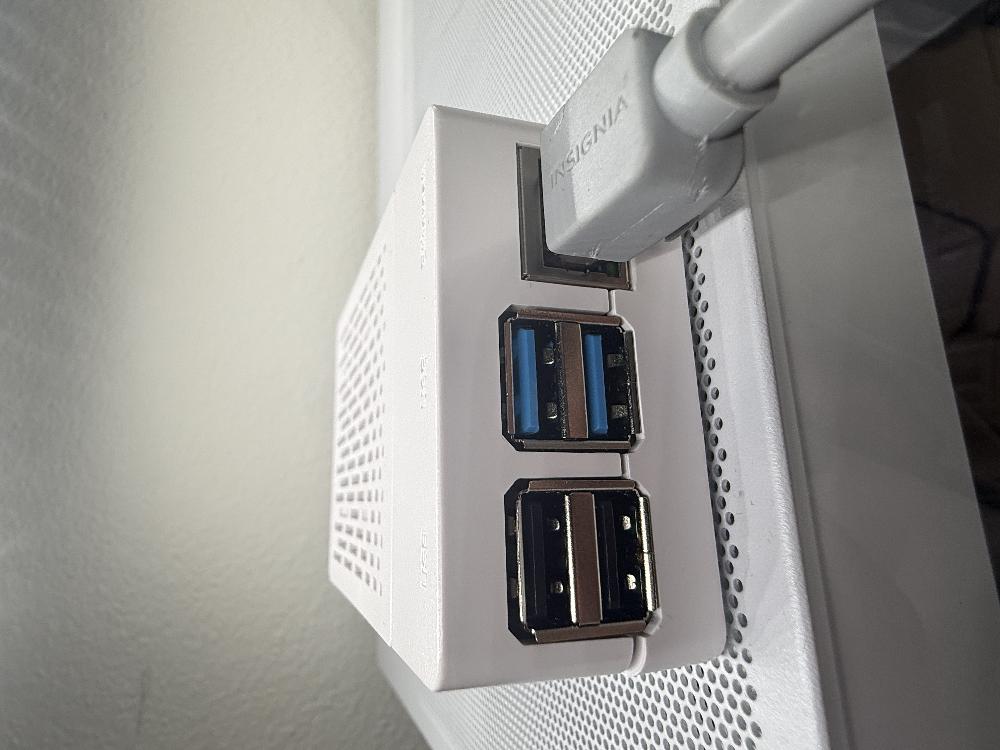

---

## Network Design

* VPN subnet: `10.86.12.0/24`
* VPN server (Raspberry Pi): `10.86.12.1`
* VPN client 1 (MacBook): `10.86.12.2`
* VPN client 2 (iPhone): `10.86.12.3`
* WireGuard UDP port: `51820`
* Pi-hole DNS: Listening on the WireGuard interface (`wg0`)

The Raspberry Pi acts as:

* A WireGuard VPN endpoint
* A router performing Network Address Translation (NAT)
* A DNS server via Pi-hole, filtering ads and trackers for all VPN clients

---

## Phase 1 — Base VPN Setup

### 1. System update and upgrade

I updated the Raspberry Pi to ensure all packages and kernel components were current before
installing WireGuard.

This helped to avoid compatibility issues with kernel modules and networking tools.

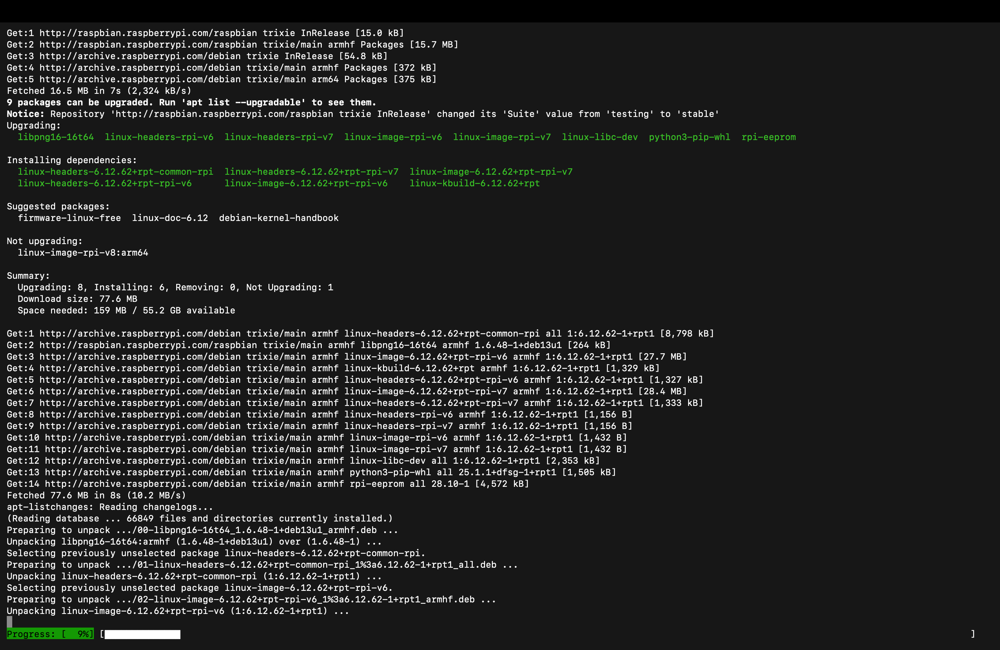

---

### 2. Installing WireGuard

WireGuard and its supporting tools were installed using the package manager.
WireGuard is a modern VPN that operates at layer 3 (IP level) and uses
cryptography with a very small attack surface.

---

### 3. Installing iptables

iptables was installed to allow the Raspberry Pi to perform packet forwarding and NAT.
This was required so my MacBook, or any VPN client, can route traffic through the Pi and out to the internet.

Without iptables masquerading, client traffic would not be able to leave the VPN interface.

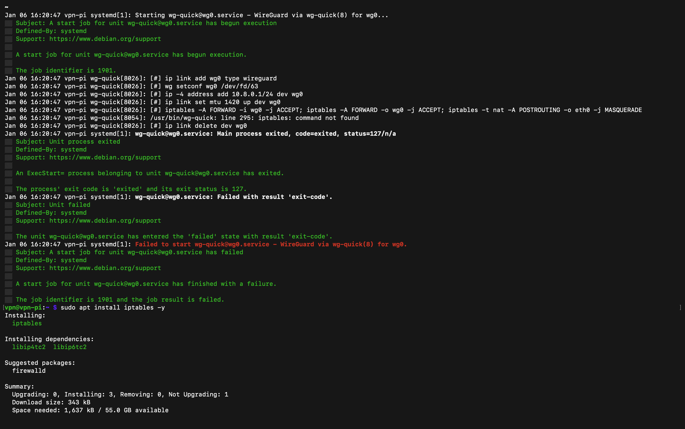

---

### 4. Generating server keys

A private and public key pair was generated for the WireGuard server.
The private key stays on the Raspberry Pi and is never shared.
The public key is distributed to clients so they can authenticate the server.

WireGuard uses public-key cryptography for authentication instead of usernames and passwords.


---

### 5. Generating client keys

A separate key pair was generated for each client device.
Each client must have its own unique key pair.

This allows the server to identify and control each peer individually.

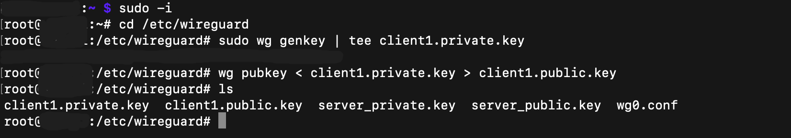

---

### 6. Enabling IP forwarding

IP forwarding was enabled so the Raspberry Pi can forward packets between interfaces.
This effectively allows the Pi to act as a router.

Without this setting, traffic from the VPN interface would be dropped.


---

### 7. WireGuard interface configuration

The `wg0` interface was configured with:

* VPN IP address
* Listening port
* Server private key
* Firewall and NAT rules using iptables

The interface was then brought up using `wg-quick` and enabled to start on boot.


---

### 8. Assigning client IPs and peers

The client's public key was added to the server configuration and assigned a static IP
address within the VPN subnet.

This ensures predictable routing and simplifies management.

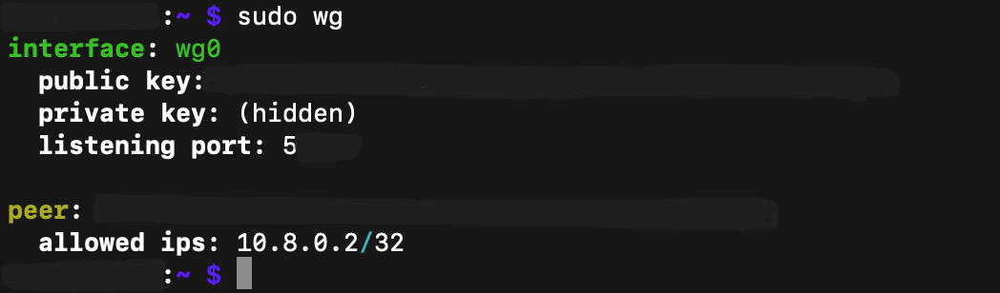

---

### 9. Client tunnel configuration

The client configuration includes:

* Client private key
* Assigned VPN IP
* Server public key
* Server public endpoint (IP and port)
* Allowed IP ranges

The client is configured to route all traffic through the VPN tunnel.

---

### 10. Tunnel established successfully

Once the tunnel is activated, the client successfully establishes a secure connection
to the Raspberry Pi.

At this point:

* Encrypted traffic flows through the tunnel
* NAT allows outbound internet access
* The VPN is fully operational

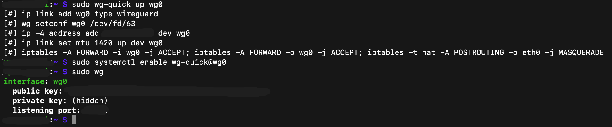

---

## Phase 2 — Pi-hole Integration

After the base VPN was running, I integrated Pi-hole to add DNS-level ad blocking
for all devices connected through the VPN tunnel.

### What Pi-hole does

Pi-hole acts as a DNS sinkhole. When a device makes a DNS request (for example, trying
to load an ad from `ads.example.com`), Pi-hole checks the domain against its blocklists.
If the domain is known for serving ads or trackers, Pi-hole refuses to resolve it;
the request never reaches the ad server.

This blocks ads, trackers, and telemetry at the DNS level before they ever load on the device.

### Setup steps

1. **Installed Pi-hole** on the Raspberry Pi alongside WireGuard
2. **Configured Pi-hole to listen on the `wg0` interface** so it can serve DNS queries from VPN clients
3. **Updated each client's WireGuard config** to set the DNS server to the Pi's tunnel IP (`10.86.12.1`), so all DNS queries from VPN clients route through Pi-hole
4. **Tested and verified** that ads and tracker domains were being blocked while connected to the VPN

### Troubleshooting

The main issue I ran into was DNS resolution failing when traffic flowed through
VPN → Pi-hole → upstream. This was resolved by making sure Pi-hole was correctly
bound to the WireGuard interface and that the client configs pointed to the right
tunnel IP for DNS.

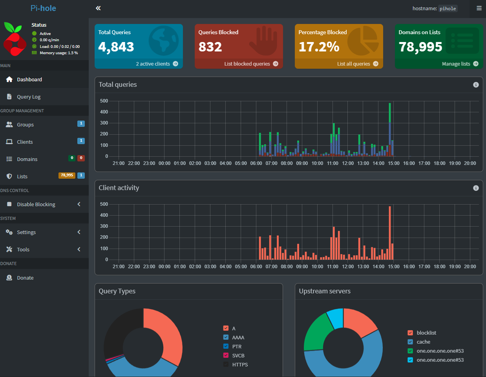
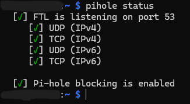

---

## Phase 3 — Multi-Client Support

The original setup only had a single peer (my MacBook). I expanded it to support
multiple clients connecting simultaneously.

### How it works

Each client device gets:

* Its own unique key pair (public and private keys)
* A dedicated IP address within the VPN subnet
* Its own `[Peer]` block in the server's WireGuard configuration
* Its own client config file with the server's public key and endpoint

### Current clients

| Device  | Tunnel IP    |
|---------|-------------|
| MacBook | 10.86.12.2  |
| iPhone  | 10.86.12.3  |

### Adding a new client

To add a new device to the VPN:

1. Generate a new key pair for the client
2. Add a new `[Peer]` block to the server's `wg0.conf` with the client's public key and assigned IP
3. Create a client config file with the server's public key, endpoint, and the client's private key
4. Set DNS to `10.86.12.1` so the client routes DNS through Pi-hole
5. Restart the WireGuard interface or reload the config

### Example server peer block (sanitized)

```ini
[Peer]
PublicKey = <client-public-key>
AllowedIPs = 10.86.12.X/32
```

### Example client config (sanitized)

```ini
[Interface]
PrivateKey = <client-private-key>
Address = 10.86.12.X/32
DNS = 10.86.12.1

[Peer]
PublicKey = <server-public-key>
AllowedIPs = 0.0.0.0/0
Endpoint = <server-public-ip>:51820
```

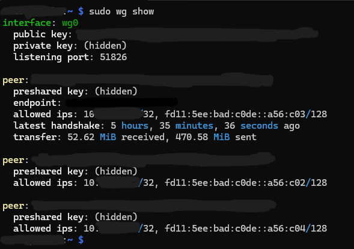

---

## Learning Outcomes

Through this project, I gained hands-on experience with:

* VPN architecture and tunneling
* Public-key authentication
* Linux networking and routing
* iptables NAT and forwarding rules
* Secure remote access design
* DNS-level ad blocking and filtering with Pi-hole
* Multi-client VPN management and peer configuration
* Troubleshooting DNS resolution across VPN tunnels
